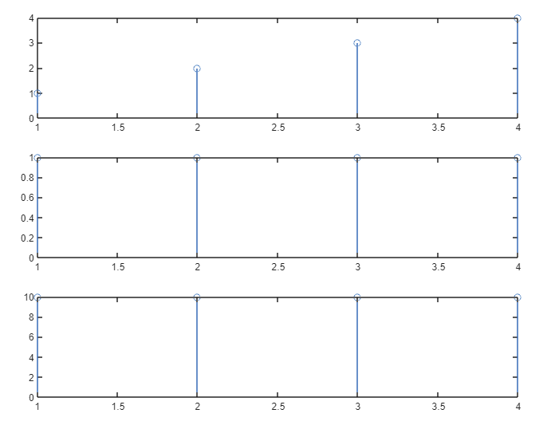

## **Roll: 1810021**
## **Course Code: ECE 4124**

### **<u>Experiment No:</u> 02**

### **<u>Experiment Date:</u> 03.05.2023**

### **<u>Experiment Name:</u> Study of Circular Convolution, Plotting of Figures, Summation, Subtraction and Particular Shapes of Two Signals Using MATLAB** 

<br>


### **<u>Theory:</u>**
                 
<br>                 
   Circular convolution is a mathematical operation used in signal processing to analyze periodic signals. In circular convolution, the signal wraps around at the edges instead of being truncated or zero-padded. This operation is performed by taking the Discrete Fourier Transform (DFT) of two signals, multiplying them pointwise, and taking the Inverse Discrete Fourier Transform (IDFT) of the result. The output is a circular convolution of the two input signals. 

<br><br>
                        


The circular convolution of two signals x[n] and h[n] can be expressed mathematically as:
<br> <br>

                           y[n] = (1/N) * sum{k=0 to N-1} x[k] * h[(n-k) mod N] 
<br>
where N is the length of the input signals, and mod represents the modulo operation. This formula calculates the convolution of two signals in a circular manner by taking the sum of the product of the samples of the two signals, where the sample index of the second signal is shifted by k samples. 


<br> <br>

Circular convolution is used in various applications, such as in digital signal processing, image processing, and communication systems. In these applications, circular convolution is used to filter, modulate, or demodulate signals. Additionally, circular convolution is used to implement circular convolutional codes, which are used in error correction coding in communication systems.

<br><br>
<br>

### **<u>Code:</u>**
<br>

#### Problem-1:

```clc
x = input('Enter the first signal: ');
subplot(3, 1, 1);
stem(x);

h = input('Enter the second signal: ');
subplot(3, 1, 2);
stem(h);

N = length(x);
M = length(h);

if N > M
    h = [h zeros(1,N-M)];
else
    x = [x zeros(1,M-N)];
end

y = zeros(1, N);
for n = 1:N
    for m = 1:N
        k = mod(n - m, N) + 1;
        y(n) = y(n) + x(m) * h(k);
    end
end

disp('Circular Convolution Output: ');
disp(y);
subplot(3, 1, 3);
stem(y);
```


<br><br>

#### Problem-2:
```
n1 = [0, 0, 0, 2, 2, 2, 1, 1, 1, 0, 2]
subplot(4, 1, 1);
stem(n1);
title('1st signal');
xlabel('Index');
ylabel('Value');

n2 = [2, 2, 0, 1, 1, 1, 0, 0, 0, 0, 3]
subplot(4, 1, 2);
stem(n2);
title('2nd signal');
xlabel('Index');
ylabel('Value');

n3=n1+n2;
subplot(4, 1, 3);
stem(n3);
title('Summation');
xlabel('Index');
ylabel('Value');


n4=n1-n2;
subplot(4, 1, 4);
stem(n4);
title('Subtraction');
xlabel('Index');
ylabel('Value');
```


<br><br>
#### Problem-3:

```
x=[0 0 1 1 1 1 0 0];
t=0:1:7;
subplot(2,1,1);
plot(t,x);

y=[0 1 1 2 2 1 1 0];
t=0:1:7;
subplot(2,1,2);
plot(t,y);
```

<br><br>


### **<u>Output:</u>** 
<br>

<div align="center">

<br>
<h4> Figure-1: Circular Convolution of Two Signals </h4> 
</div>


<br><br>

<div align="center">

<h4>Figure-2: Result </h4> 

</div>
<br><br>


<div align="center">

<br>
<h4> Figure-3: Two Signals, Summation and Subtraction </h4> 
</div>


<br><br>


<div align="center">

<br>
<h4> Figure-4: Particular Shape of Two Signals</h4> 
</div>


<br><br>


### **<u>Discussion:</u>** 
<br>
Circular convolution of two signals was carried out without using any built-in
function. The built-in function was also used to check whether the previous output was similar or
not. The obtained result was same in both the cases. Then two signals, their summation and
subtraction were also plotted as well as particular shape of two signals.
<br><br>

### **<u>Conclusion:</u>**
<br> 
The experiment was carried out successfully.
