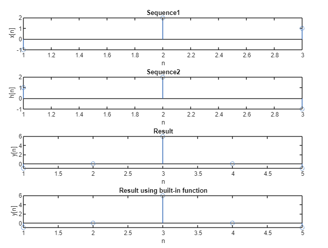
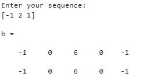
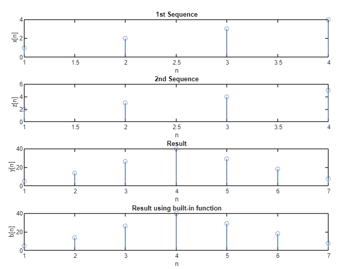
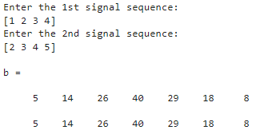

## **Roll: 1810021**
## **Course Code: ECE 4124**

### **<u>Experiment No:</u> 03**

### **<u>Experiment Date:</u> 08.05.2023**

### **<u>Experiment Name:</u> Study of Auto-correlation & Cross-correlation Using MATLAB** 

<br>


### **<u>Theory:</u>**
                 
<br>                 
  Auto-correlation and cross-correlation are statistical measures used in signal
processing and data analysis to analyze the similarity or relationship between signals. Autocorrelation measures the similarity of a signal with a time-shifted version of itself, while crosscorrelation measures the similarity between two different signals.
<br><br>
                        


Auto-correlation:
<br>
 Auto-correlation is a measure of the similarity between a signal and a delayed
(shifted) version of itself. It is commonly used to detect repeating patterns or periodicity in a
signal. In auto-correlation, the correlation is calculated at different time lags.


<br> <br>
Cross-correlation:
<br>
 Cross-correlation is a measure of the similarity between two different signals.
It is used to determine the relationship, time delay, or similarity between two signals. Crosscorrelation is often used in applications such as signal matching, time delay estimation, and
pattern recognition.


<br><br>
By studying the auto-correlation and cross-correlation of signals, we can gain insights into the
periodicity, similarity, and time relationships between signals, which can be valuable in
applications such as signal processing, time series analysis, and pattern recognition.

<br><br>
<br>

### **<u>Code:</u>**
<br>

#### Problem-1:

```clc
x=input('Enter your sequence:');
h=fliplr(x);
a=length(x);
b=length(h);
n=a+b-1;
y=zeros(1,n);
l=1:n;
for i=0:n
for j=0:n
if((i-j+1)>0 && (i-j+1)<=b && (j+1)<=a)
y(i+1)=y(i+1)+x(j+1).*h(i-j+1);
end
end
end
b=xcorr(x,x)
disp(y)
subplot(4,1,1)
stem(x)
xlabel('n');
ylabel('x[n]');
title('Sequence1');
subplot(4,1,2)
stem(h)
xlabel('n');
ylabel('h[n]');
title('Sequence2');
subplot(4,1,3);
stem(l,y)
xlabel('n');
ylabel('y[n]');
title('Result');
subplot(4,1,4);
stem(b)
xlabel('n');
ylabel('y[n]');
title('Result using built-in function');
```


<br><br>

#### Problem-2:
```
x = input('Enter the 1st signal sequence:');
h = input('Enter the 2nd signal sequence: ');
z=fliplr(h);
a=length(x);
b=length(z);
n=a+b-1;
y=zeros(1,n);
l=1:n;
for i=0:n
 for j=0:n
 if((i-j+1)>0 && (i-j+1)<=b && (j+1)<=a)
 y(i+1)=y(i+1)+x(j+1).*z(i-j+1);
 end
 end
end
b=xcorr(x,h)
disp(y)
subplot(4, 1, 1);
stem(x);
xlabel('n');
ylabel('x[n]');
title('1st Sequence');
subplot(4, 1, 2);
stem(h);
xlabel('n');
ylabel('z[n]');
title('2nd Sequence');
subplot(4, 1, 3);
stem(l,y);
xlabel('n');
ylabel('y[n]');
title('Result');
subplot(4, 1, 4);
stem(b);
xlabel('n');
ylabel('b[n]');
title('Result using built-in function');
```


<br><br>


### **<u>Output:</u>** 
<br>

#### Problem-1:

<div align="center">

<br>
<h4> Figure-1: Auto-correlation Graphical Output </h4> 
</div>


<br><br>

<div align="center">

<h4>Figure-2: Auto-correlation Result</h4> 

</div>
<br><br>

#### Problem-2:

<div align="center">

<br>
<h4> Figure-3: Cross-correlation Graphical Output </h4> 
</div>


<br><br>


<div align="center">

<br>
<h4> Figure-4: Cross-correlation Result</h4> 
</div>


<br><br>


### **<u>Discussion:</u>** 
<br>
:
 Auto-correlation of a signal and cross-correlation of two signals were carried out
without using any built-in function. The built-in function was also used to check whether the
previous output was similar or not. The obtained result was same in both the cases. Signals, their
auto-correlation and cross-correlation with and without built-in functions were all plotted in
MATLAB.
<br><br>

### **<u>Conclusion:</u>**
<br> 
The experiment was carried out successfully.
