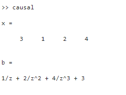
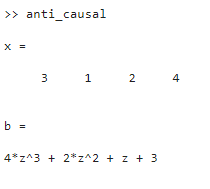

## **Roll: 1810021**
## **Course Code: ECE 4124**

### **<u>Experiment No:</u> 05**

### **<u>Experiment Date:</u> 22.05.2023**

### **<u>Experiment Name:</u>Study of Causal, Anti-causal, Non-causal Signals, Their Respective Poles & Zeros on the Z-plane** 

<br>


### **<u>Theory:</u>**
                 
<br>                 
   In signal processing and system theory, causal, anti-causal, and non-causal signals describe different relationships between the cause and effect of a signal.

<br>
                        

i). Causal Signals: A causal signal is one in which the output values depend only on past and present input values, but not on future input values. In other words, the output at any given time depends only on the past and present input values up to that time. Causal signals are commonly encountered in many physical systems and real-world phenomena. Examples of causal signals include a temperature sensor reading, stock market data, or an audio recording.

ii) . Anti-causal Signals: An anti-causal signal is the opposite of a causal signal. It means that the output values depend only on future and present input values, but not on past input values. In other words, the output at any given time depends only on the present and future input values. Anti-causal signals are less common in practice and often arise in theoretical scenarios. An example of an anti-causal signal could be a prediction of future stock prices based on present and future information, without considering past data.

iii). Non-causal Signals: Non-causal signals are those where the output values depend on both past and future input values. These signals violate the causality principle and are typically considered hypothetical or theoretical constructs. Non-causal signals cannot be realized in practice, but they can be used as mathematical models or as a tool for analysis. They can help understand the behavior of systems or explore theoretical concepts. An example of a non-causal signal could be a mathematical function that produces an output based on both past and future input values.


<br> <br>


### **<u>Code:</u>**
<br>

i). Causal Signal:

```
x=[3 1 2 4]
b=0;
n=length(x);
y=sym('z');
for i=1:n
 b=b+x(i)*y^(1-i);
end
display(b)
z=[];
p=[0]
zplane(z,p)
```

<br>
<br>

ii). Anti-causal Signal:

```
x=[3 1 2 4]
b=0;
n=length(x);
y=sym('z');
for i=1:n
 b=b+x(i)*y^(i-1);
end
display(b)
z=[];
p=[]
zplane(z,p)
```
<br>
<br>

iii). Non-causal Signal:

```
x=[3 1 2 4]
c=input('Enter the Index: ');
disp(c);
b=0;
n=length(x);
y=sym('z');

for i=0:n-1
    if i>=c-1
    b=b+x(i+1)*y^(c-i-1);

    else
    b=b+x(i+1)/y^(i-c+1);
    end
end    

display(b)

z=[];
p=[0]
zplane(z,p)
```

<br><br>


### **<u>Output:</u>** 
<br>
i). Causal Signal:
<br>
<div align="center">

<br>
<h4> Figure-1: Poles and Zeros Graphical Output </h4> 
</div>


<br><br>

<div align="center">

<h4>Figure-2: Result </h4> 

</div>
<br><br> <br>

ii). Ani-causal Signal:
<br>
<div align="center">

<br>
<h4> Figure-1: Poles and Zeros Graphical Output </h4> 
</div>


<br><br>

<div align="center">

<h4>Figure-2: Result </h4> 

</div>
<br><br><br>

iii). Non-causal Signal:
<br>
<div align="center">

<br>
<h4> Figure-1: Poles and Zeros Graphical Output </h4> 
</div>


<br><br>

<div align="center">

<h4>Figure-2: Result </h4> 

</div>
<br><br>


### **<u>Discussion:</u>** 
<br>
From this experiment, we’ve learnt about causal, anti-causal and non-causal signals and also observed their respective poles and zeros.
<br>
<br>

A causal signal is a sequence that has values only for nonnegative indices or time instances. When we apply the Z-transform to a causal signal, we typically obtain a rational function with a region of convergence (ROC) that encompasses the unit circle. 
<br>
<br>

Again, an anti-causal signal, on the other hand, is a sequence that has values only for negative indices or time instances. When we apply the Z-transform to an anti-causal signal, we typically obtain a rational function with a region of convergence (ROC) that encompasses the exterior of the unit circle. 
<br>
<br>

Lastly, a non-causal signal is a sequence that has nonzero values for both positive and negative indices or time instances. Although the Z-transform can still be computed for a non-causal signal, the resulting expression may not be a rational function, and the ROC may form a ring or annulus in the Z-plane.


<br><br>

### **<u>Conclusion:</u>**
<br> 
The experiment was carried out successfully.
