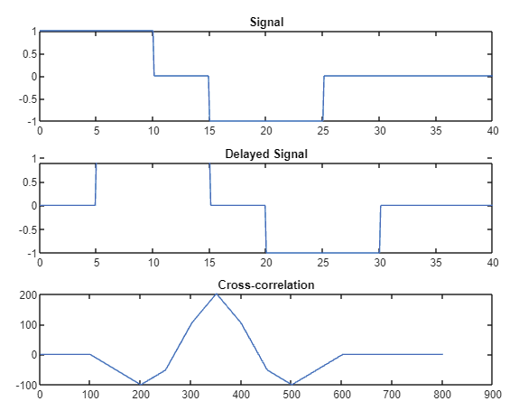
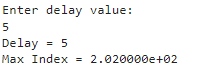

### **<u>Experiment No:</u> 04**

### **<u>Experiment Date:</u> 15.05.2023**

### **<u>Experiment Name:</u> Study of Time Delay of a Signal Using the Cross-correlation Method** 

<br>


### **<u>Theory:</u>**
                 
<br>                 
    Time delay basically means a delay that separates the occurrence of two events, it is the amount of time a signal takes to propagate itself through a system or under specified processing conditions. There is a huge significance of time delay in signal processing applications. It occurs in the various stages of signal processing such as DSP filters, Multirate filters, signal transformation, etc.

<br><br>
                        

In signal processing, cross-correlation is a measure of similarity of two series as a function of the displacement of one relative to the other. This is also known as a sliding dot product or sliding inner-product. It is commonly used for searching a long signal for a shorter, known feature. It has applications in pattern recognition, single particle analysis, electron tomography, averaging, cryptanalysis, and neurophysiology. The cross-correlation is similar in nature to the convolution of two functions.


<br> <br>


### **<u>Code:</u>**
<br>

```clc
clear all

t=0:0.1:40
x1=(t>=0 & t<=10);
x2=(t>=10 & t<=15);
x3=(t>=15 & t<=25);
x4=(t>=25 & t<=40);
s1 = 1*x1+0*x2-1*x3+0*x4;
subplot(3,1,1);
plot(t,s1);
title('Signal');

d = input('Enter delay value:');

x5=(t>=0+d & t<=10+d);
x6=(t>=10+d & t<=15+d);
x7=(t>=15+d & t<=25+d);
x8=(t>=25+d & t<=40+d);
s2 = 1*x5+0*x6-1*x7+0*x8;
subplot(3,1,2);
plot(t,s2);
title('Delayed Signal');

s3 = xcorr(s1,s2);
subplot(3,1,3);
plot(s3);
title('Cross-correlation');
max_index= max(s3);

fprintf('Delay = %d\n', d);
fprintf('Max Index = %d\n', max(s3));
```


<br><br>


### **<u>Output:</u>** 
<br>

<div align="center">

<br>
<h4> Figure-1: Cross-correlation of Delayed Signal Graphical Output </h4> 
</div>


<br><br>

<div align="center">

<h4>Figure-2: Result </h4> 

</div>
<br><br>


### **<u>Discussion:</u>** 
<br>
At first, a signal was plotted, after that the delayed signal was plotted with the value of time delay. The cross-correlation built-in function was used to correlate the former and latter signals and it was also visualized. The expected result was obtained from the experiment, the delayed time value and max index were also shown.

<br><br>

### **<u>Conclusion:</u>**
<br> 
The experiment was carried out successfully.
