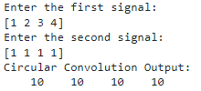
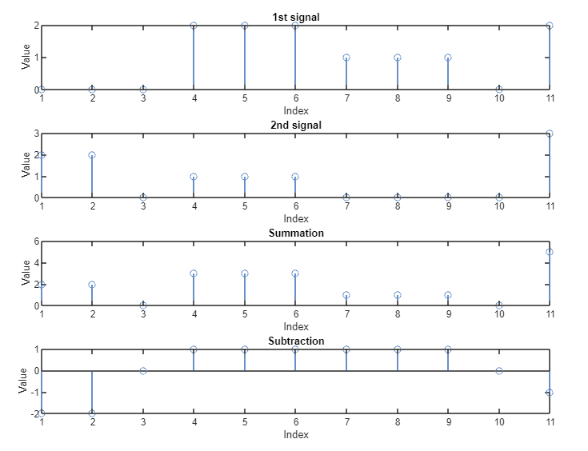
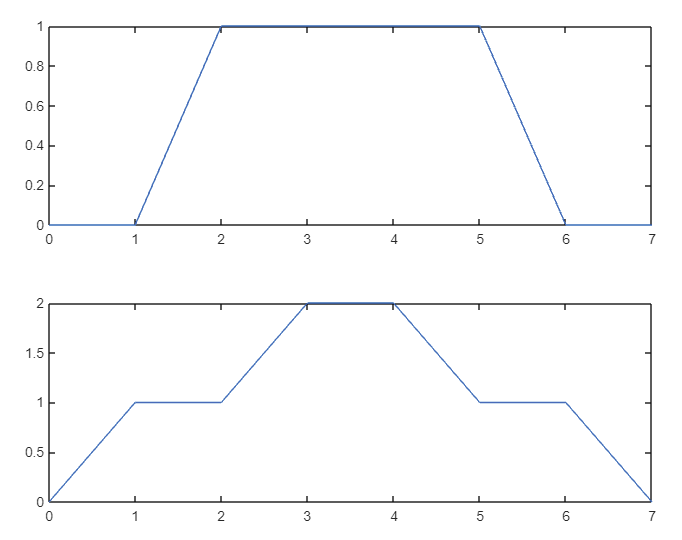
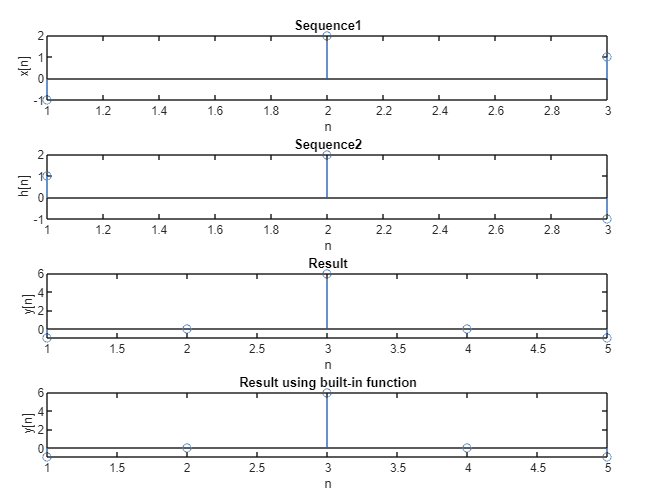
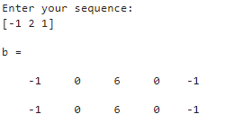
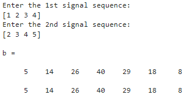

<h3 align='center'>Heaven’s Light is Our Guide</h3>
<h1 align='center'>Rajshahi University of Engineering & Technology<h1>

<div align="center">

</div>

<h2><u>Course Code</u>: ECE 4124</h2>
<h2><u>Course Title</u>: Digital Signal Processing Sessional</h2>

<br>
<br>

<div style='display: flex; justify-content: space-between;'>
<div>
<h2><u>Submitted To,</u>
<br>Hafsa Binte Kibria                                             <br>Lecturer, Dept. of ECE, RUET</h2>  
</div>
<div>
<h2><u>Submitted By,</u><br>
S.M. Faizul Islam Fair<br>                                                   
Roll: 1810021                                                            </h2>                                                   
</div>

</div>

<br>
<br>
<br>

| Serial | Experiment Name | Link |
|-----------------|----------------|----------------|
| 01 |  Study of Convolution of Two Signals using MATLAB | <a href='#exp_1'>Experiment_1</a>|
| 02 |  Study of Circular Convolution, Plotting of Figures, Summation, Subtraction and Particular Shapes of Two Signals Using MATLAB | <a href='#exp_2'>Experiment_2</a> |
| 03 |  Study of Auto-correlation & Cross-correlation Using MATLAB | <a href='#exp_3'>Experiment_3</a> |
| 04 |  Study of Time Delay of a Signal Using the Cross-correlation Method  | <a href='#exp_4'>Experiment_4</a> |
| 05 | Study of Causal, Anti-causal, Non-causal Signals, Their Respective Poles & Zeros on the Z-plane | <a href='#exp_5'>Experiment_5</a>|


<br>
<br>
<br>
<br>
<br>

<div id='exp_1'>
<br>
<br>

### **<u>Experiment No:</u> 01**

### **<u>Experiment Date:</u> 19.03.2023**

### **<u>Experiment Name:</u> Study of Convolution of Two Signals using MATLAB** 

<br>


### **<u>Theory:</u>**
                 
<br>                 
                   The convolution of two signals is a mathematical operation that combines the two signals to produce a third signal that represents how one signal modifies the other as they are combined. It is a fundamental operation in signal processing, used for various applications such as filtering, feature extraction, image processing, and many more.
<br>
<br>

                                          y(n) = ∑ x(n)*h(n-k) for k = - ∞ to + ∞


<br><br>
                        

There are two types of convolutions: 

i). Continuous convolution: Continuous convolution is used to describe the convolution of two continuous-time signal. It is defined as follows: 
Given two continuous-time signal x(t) and h(t), their continuous convolution y(t) is given by: 
                                                          y(t) = x(t) * h(t)


ii). Discrete convolution: Discrete convolution is used to describe the convolution of two discrete-time signal. It is defined as follows: 
                                                         y(n) = x(n) * h(n)
                


<br> <br>


### **<u>Code:</u>**
<br>

```clc
x = [ 1 2 3 4]; 

h = [ 4 4 3 2]; 


m=length(x); 
l=length(h); 
X=[x,zeros(1,l)]; 
H=[h,zeros(1,m)]; 


z=[]; 
for i=1:m 
      g=h.*x(i); 
      z=[z;g]; 
end 


[r c] = size(z); 
k = r+c; 
t =2; 
Y =[]; 
cd =0; 


while(t<=k) 
         for i=1:r 
               for j=1:c 
                    if((i+j)==t) 
                          cd = cd+ z(i,j); 
                    end 
                end 
           end 
           t = t+1; 
          Y = [Y cd]; 
           cd =0; 
end 

subplot(3,1,1); 
stem(x); 
xlabel('n'); 
ylabel('x'); 
title('1st Signal'); 
subplot(3,1,2); 
stem(h); 
xlabel('n'); 
ylabel('h'); 
title('2nd Signal'); 


subplot(3,1,3); 
stem(Y); 
xlabel('n'); 
ylabel('Y'); 
title('Convoluted Signal');

```


<br><br>


### **<u>Output:</u>** 
<br>

<div align="center">

<br>
<h4> Figure-1: Convolution of Two Signals </h4> 
</div>


<br><br>


### **<u>Discussion:</u>** 
<br>
Here, we convoluted two signals without using the conv() function. The conv() function was also used to check whether the previous output was similar or not. The obtained result was same in both the cases.

<br><br>

### **<u>Conclusion:</u>**
<br> 
The experiment was carried out successfully.

</div>


<br>
<br>
<br>
<br>
<br>

<div id='exp_2'>
<br>
<br>

### **<u>Experiment No:</u> 02**

### **<u>Experiment Date:</u> 03.05.2023**

### **<u>Experiment Name:</u> Study of Circular Convolution, Plotting of Figures, Summation, Subtraction and Particular Shapes of Two Signals Using MATLAB** 

<br>


### **<u>Theory:</u>**
                 
<br>                 
   Circular convolution is a mathematical operation used in signal processing to analyze periodic signals. In circular convolution, the signal wraps around at the edges instead of being truncated or zero-padded. This operation is performed by taking the Discrete Fourier Transform (DFT) of two signals, multiplying them pointwise, and taking the Inverse Discrete Fourier Transform (IDFT) of the result. The output is a circular convolution of the two input signals. 

<br><br>
                        


The circular convolution of two signals x[n] and h[n] can be expressed mathematically as:
<br> <br>

                           y[n] = (1/N) * sum{k=0 to N-1} x[k] * h[(n-k) mod N] 
<br>
where N is the length of the input signals, and mod represents the modulo operation. This formula calculates the convolution of two signals in a circular manner by taking the sum of the product of the samples of the two signals, where the sample index of the second signal is shifted by k samples. 


<br> <br>

Circular convolution is used in various applications, such as in digital signal processing, image processing, and communication systems. In these applications, circular convolution is used to filter, modulate, or demodulate signals. Additionally, circular convolution is used to implement circular convolutional codes, which are used in error correction coding in communication systems.

<br><br>
<br>

### **<u>Code:</u>**
<br>

#### Problem-1:

```clc
x = input('Enter the first signal: ');
subplot(3, 1, 1);
stem(x);

h = input('Enter the second signal: ');
subplot(3, 1, 2);
stem(h);

N = length(x);
M = length(h);

if N > M
    h = [h zeros(1,N-M)];
else
    x = [x zeros(1,M-N)];
end

y = zeros(1, N);
for n = 1:N
    for m = 1:N
        k = mod(n - m, N) + 1;
        y(n) = y(n) + x(m) * h(k);
    end
end

disp('Circular Convolution Output: ');
disp(y);
subplot(3, 1, 3);
stem(y);
```


<br><br>

#### Problem-2:
```
n1 = [0, 0, 0, 2, 2, 2, 1, 1, 1, 0, 2]
subplot(4, 1, 1);
stem(n1);
title('1st signal');
xlabel('Index');
ylabel('Value');

n2 = [2, 2, 0, 1, 1, 1, 0, 0, 0, 0, 3]
subplot(4, 1, 2);
stem(n2);
title('2nd signal');
xlabel('Index');
ylabel('Value');

n3=n1+n2;
subplot(4, 1, 3);
stem(n3);
title('Summation');
xlabel('Index');
ylabel('Value');


n4=n1-n2;
subplot(4, 1, 4);
stem(n4);
title('Subtraction');
xlabel('Index');
ylabel('Value');
```


<br><br>
#### Problem-3:

```
x=[0 0 1 1 1 1 0 0];
t=0:1:7;
subplot(2,1,1);
plot(t,x);

y=[0 1 1 2 2 1 1 0];
t=0:1:7;
subplot(2,1,2);
plot(t,y);
```

<br><br>


### **<u>Output:</u>** 
<br>

<div align="center">

<br>
<h4> Figure-1: Circular Convolution of Two Signals </h4> 
</div>


<br><br>

<div align="center">

<h4>Figure-2: Result </h4> 

</div>
<br><br>


<div align="center">

<br>
<h4> Figure-3: Two Signals, Summation and Subtraction </h4> 
</div>


<br><br>


<div align="center">

<br>
<h4> Figure-4: Particular Shape of Two Signals</h4> 
</div>


<br><br>


### **<u>Discussion:</u>** 
<br>
Circular convolution of two signals was carried out without using any built-in
function. The built-in function was also used to check whether the previous output was similar or
not. The obtained result was same in both the cases. Then two signals, their summation and
subtraction were also plotted as well as particular shape of two signals.
<br><br>

### **<u>Conclusion:</u>**
<br> 
The experiment was carried out successfully.

</div>


<br>
<br>
<br>
<br>
<br>

<div id='exp_3'>
<br>
<br>

### **<u>Experiment No:</u> 03**

### **<u>Experiment Date:</u> 08.05.2023**

### **<u>Experiment Name:</u> Study of Auto-correlation & Cross-correlation Using MATLAB** 

<br>


### **<u>Theory:</u>**
                 
<br>                 
  Auto-correlation and cross-correlation are statistical measures used in signal
processing and data analysis to analyze the similarity or relationship between signals. Autocorrelation measures the similarity of a signal with a time-shifted version of itself, while crosscorrelation measures the similarity between two different signals.
<br><br>
                        


Auto-correlation:
<br>
 Auto-correlation is a measure of the similarity between a signal and a delayed
(shifted) version of itself. It is commonly used to detect repeating patterns or periodicity in a
signal. In auto-correlation, the correlation is calculated at different time lags.


<br> <br>
Cross-correlation:
<br>
 Cross-correlation is a measure of the similarity between two different signals.
It is used to determine the relationship, time delay, or similarity between two signals. Crosscorrelation is often used in applications such as signal matching, time delay estimation, and
pattern recognition.


<br><br>
By studying the auto-correlation and cross-correlation of signals, we can gain insights into the
periodicity, similarity, and time relationships between signals, which can be valuable in
applications such as signal processing, time series analysis, and pattern recognition.

<br><br>
<br>

### **<u>Code:</u>**
<br>

#### Problem-1:

```clc
x=input('Enter your sequence:');
h=fliplr(x);
a=length(x);
b=length(h);
n=a+b-1;
y=zeros(1,n);
l=1:n;
for i=0:n
for j=0:n
if((i-j+1)>0 && (i-j+1)<=b && (j+1)<=a)
y(i+1)=y(i+1)+x(j+1).*h(i-j+1);
end
end
end
b=xcorr(x,x)
disp(y)
subplot(4,1,1)
stem(x)
xlabel('n');
ylabel('x[n]');
title('Sequence1');
subplot(4,1,2)
stem(h)
xlabel('n');
ylabel('h[n]');
title('Sequence2');
subplot(4,1,3);
stem(l,y)
xlabel('n');
ylabel('y[n]');
title('Result');
subplot(4,1,4);
stem(b)
xlabel('n');
ylabel('y[n]');
title('Result using built-in function');
```


<br><br>

#### Problem-2:
```
x = input('Enter the 1st signal sequence:');
h = input('Enter the 2nd signal sequence: ');
z=fliplr(h);
a=length(x);
b=length(z);
n=a+b-1;
y=zeros(1,n);
l=1:n;
for i=0:n
 for j=0:n
 if((i-j+1)>0 && (i-j+1)<=b && (j+1)<=a)
 y(i+1)=y(i+1)+x(j+1).*z(i-j+1);
 end
 end
end
b=xcorr(x,h)
disp(y)
subplot(4, 1, 1);
stem(x);
xlabel('n');
ylabel('x[n]');
title('1st Sequence');
subplot(4, 1, 2);
stem(h);
xlabel('n');
ylabel('z[n]');
title('2nd Sequence');
subplot(4, 1, 3);
stem(l,y);
xlabel('n');
ylabel('y[n]');
title('Result');
subplot(4, 1, 4);
stem(b);
xlabel('n');
ylabel('b[n]');
title('Result using built-in function');
```


<br><br>


### **<u>Output:</u>** 
<br>

#### Problem-1:

<div align="center">

<br>
<h4> Figure-1: Auto-correlation Graphical Output </h4> 
</div>


<br><br>

<div align="center">

<h4>Figure-2: Auto-correlation Result</h4> 

</div>
<br><br>

#### Problem-2:

<div align="center">

<br>
<h4> Figure-3: Cross-correlation Graphical Output </h4> 
</div>


<br><br>


<div align="center">

<br>
<h4> Figure-4: Cross-correlation Result</h4> 
</div>


<br><br>


### **<u>Discussion:</u>** 
<br>
 Auto-correlation of a signal and cross-correlation of two signals were carried out
without using any built-in function. The built-in function was also used to check whether the
previous output was similar or not. The obtained result was same in both the cases. Signals, their
auto-correlation and cross-correlation with and without built-in functions were all plotted in
MATLAB.
<br><br>

### **<u>Conclusion:</u>**
<br> 
The experiment was carried out successfully.

</div>

<br>
<br>
<br>
<br>
<br>


<div id='exp_4'>
<br>
<br>

### **<u>Experiment No:</u> 04**

### **<u>Experiment Date:</u> 15.05.2023**

### **<u>Experiment Name:</u> Study of Time Delay of a Signal Using the Cross-correlation Method** 

<br>


### **<u>Theory:</u>**
                 
<br>                 
    Time delay basically means a delay that separates the occurrence of two events, it is the amount of time a signal takes to propagate itself through a system or under specified processing conditions. There is a huge significance of time delay in signal processing applications. It occurs in the various stages of signal processing such as DSP filters, Multirate filters, signal transformation, etc.

<br><br>
                        

In signal processing, cross-correlation is a measure of similarity of two series as a function of the displacement of one relative to the other. This is also known as a sliding dot product or sliding inner-product. It is commonly used for searching a long signal for a shorter, known feature. It has applications in pattern recognition, single particle analysis, electron tomography, averaging, cryptanalysis, and neurophysiology. The cross-correlation is similar in nature to the convolution of two functions.


<br> <br>


### **<u>Code:</u>**
<br>

```clc
clear all

t=0:0.1:40
x1=(t>=0 & t<=10);
x2=(t>=10 & t<=15);
x3=(t>=15 & t<=25);
x4=(t>=25 & t<=40);
s1 = 1*x1+0*x2-1*x3+0*x4;
subplot(3,1,1);
plot(t,s1);
title('Signal');

d = input('Enter delay value:');

x5=(t>=0+d & t<=10+d);
x6=(t>=10+d & t<=15+d);
x7=(t>=15+d & t<=25+d);
x8=(t>=25+d & t<=40+d);
s2 = 1*x5+0*x6-1*x7+0*x8;
subplot(3,1,2);
plot(t,s2);
title('Delayed Signal');

s3 = xcorr(s1,s2);
subplot(3,1,3);
plot(s3);
title('Cross-correlation');
max_index= max(s3);

fprintf('Delay = %d\n', d);
fprintf('Max Index = %d\n', max(s3));
```


<br><br>


### **<u>Output:</u>** 
<br>

<div align="center">

<br>
<h4> Figure-1: Cross-correlation of Delayed Signal Graphical Output </h4> 
</div>


<br><br>

<div align="center">

<h4>Figure-2: Result </h4> 

</div>
<br><br>


### **<u>Discussion:</u>** 
<br>
At first, a signal was plotted, after that the delayed signal was plotted with the value of time delay. The cross-correlation built-in function was used to correlate the former and latter signals and it was also visualized. The expected result was obtained from the experiment, the delayed time value and max index were also shown.

<br><br>

### **<u>Conclusion:</u>**
<br> 
The experiment was carried out successfully.

<div>
<br>
<br>
<br>
<br>
<br>


<div id='exp_5'>
<br>
<br>

### **<u>Experiment No:</u> 05**

### **<u>Experiment Date:</u> 22.05.2023**

### **<u>Experiment Name:</u>Study of Causal, Anti-causal, Non-causal Signals, Their Respective Poles & Zeros on the Z-plane** 

<br>


### **<u>Theory:</u>**
                 
<br>                 
   In signal processing and system theory, causal, anti-causal, and non-causal signals describe different relationships between the cause and effect of a signal.

<br>
                        

i). Causal Signals: A causal signal is one in which the output values depend only on past and present input values, but not on future input values. In other words, the output at any given time depends only on the past and present input values up to that time. Causal signals are commonly encountered in many physical systems and real-world phenomena. Examples of causal signals include a temperature sensor reading, stock market data, or an audio recording.

ii) . Anti-causal Signals: An anti-causal signal is the opposite of a causal signal. It means that the output values depend only on future and present input values, but not on past input values. In other words, the output at any given time depends only on the present and future input values. Anti-causal signals are less common in practice and often arise in theoretical scenarios. An example of an anti-causal signal could be a prediction of future stock prices based on present and future information, without considering past data.

iii). Non-causal Signals: Non-causal signals are those where the output values depend on both past and future input values. These signals violate the causality principle and are typically considered hypothetical or theoretical constructs. Non-causal signals cannot be realized in practice, but they can be used as mathematical models or as a tool for analysis. They can help understand the behavior of systems or explore theoretical concepts. An example of a non-causal signal could be a mathematical function that produces an output based on both past and future input values.


<br> <br>


### **<u>Code:</u>**
<br>

i). Causal Signal:

```
x=[3 1 2 4]
b=0;
n=length(x);
y=sym('z');
for i=1:n
 b=b+x(i)*y^(1-i);
end
display(b)
z=[];
p=[0]
zplane(z,p)
```

<br>
<br>

ii). Anti-causal Signal:

```
x=[3 1 2 4]
b=0;
n=length(x);
y=sym('z');
for i=1:n
 b=b+x(i)*y^(i-1);
end
display(b)
z=[];
p=[]
zplane(z,p)
```
<br>
<br>

iii). Non-causal Signal:

```
x=[3 1 2 4]
c=input('Enter the Index: ');
disp(c);
b=0;
n=length(x);
y=sym('z');

for i=0:n-1
    if i>=c-1
    b=b+x(i+1)*y^(c-i-1);

    else
    b=b+x(i+1)/y^(i-c+1);
    end
end    

display(b)

z=[];
p=[0]
zplane(z,p)
```

<br><br>


### **<u>Output:</u>** 
<br>
i). Causal Signal:
<br>
<div align="center">

<br>
<h4> Figure-1: Poles and Zeros Graphical Output </h4> 
</div>


<br><br>

<div align="center">

<h4>Figure-2: Result </h4> 

</div>
<br><br> <br>

ii). Ani-causal Signal:
<br>
<div align="center">

<br>
<h4> Figure-1: Poles and Zeros Graphical Output </h4> 
</div>


<br><br>

<div align="center">

<h4>Figure-2: Result </h4> 

</div>
<br><br><br>

iii). Non-causal Signal:
<br>
<div align="center">

<br>
<h4> Figure-1: Poles and Zeros Graphical Output </h4> 
</div>


<br><br>

<div align="center">

<h4>Figure-2: Result </h4> 

</div>
<br><br>


### **<u>Discussion:</u>** 
<br>
From this experiment, we’ve learnt about causal, anti-causal and non-causal signals and also observed their respective poles and zeros.
<br>
<br>

A causal signal is a sequence that has values only for nonnegative indices or time instances. When we apply the Z-transform to a causal signal, we typically obtain a rational function with a region of convergence (ROC) that encompasses the unit circle. 
<br>
<br>

Again, an anti-causal signal, on the other hand, is a sequence that has values only for negative indices or time instances. When we apply the Z-transform to an anti-causal signal, we typically obtain a rational function with a region of convergence (ROC) that encompasses the exterior of the unit circle. 
<br>
<br>

Lastly, a non-causal signal is a sequence that has nonzero values for both positive and negative indices or time instances. Although the Z-transform can still be computed for a non-causal signal, the resulting expression may not be a rational function, and the ROC may form a ring or annulus in the Z-plane.


<br><br>

### **<u>Conclusion:</u>**
<br> 
The experiment was carried out successfully.

</div>